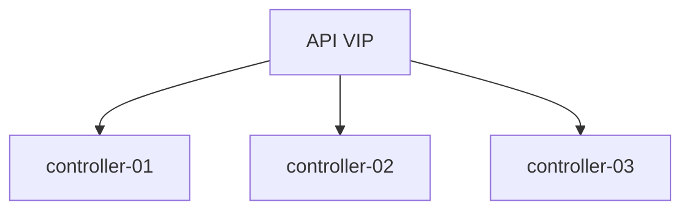

# OpenStack Platform Factory

Declarative High Level Design (HLD) generation, infrastructure automation, documentation, diagrams and deployment pipeline for production-grade OpenStack private clouds.

---

# Overview

OpenStack Platform Factory transforms a declarative architecture model into:

- Infrastructure as Code (Terraform)
- Configuration management (Ansible)
- Architecture documentation
- Network and platform diagrams
- Validation rules
- CI/CD deployment pipelines

The goal is to eliminate static documentation and convert the HLD into a living, versioned and deployable architecture definition.

---

# Architecture Philosophy

The platform follows several principles:

- Declarative architecture
- Infrastructure as Code
- Immutable documentation
- Automated validation
- Production-ready HA patterns
- Multi-AZ design
- GitOps-friendly workflows

---

# Repository Structure

```text
openstack-platform-factory/
│
├── hld-model/
│   └── cloud.yaml
│
├── generators/
│   ├── generate_terraform.py
│   ├── generate_docs.py
│   ├── generate_diagrams.py
│   ├── generate_ansible_inventory.py
│   └── validate_hld.py
│
├── terraform/
│   ├── main.tf
│   ├── networks.tf
│   ├── compute.tf
│   ├── octavia.tf
│   └── outputs.tf
│
├── ansible/
│   ├── site.yml
│   ├── inventory.ini
│   ├── group_vars/
│   └── roles/
│
├── diagrams/
│   ├── architecture.py
│   ├── openstack-ha.mmd
│   ├── network-topology.mmd
│   └── tenant-lb.mmd
│
├── docs/
│   ├── index.md
│   ├── architecture.md
│   ├── networking.md
│   ├── high-availability.md
│   ├── storage.md
│   ├── load-balancing.md
│   └── operations.md
│
├── tests/
│   ├── test_hld_schema.py
│   ├── test_ha_rules.py
│   └── test_network_rules.py
│
└── .gitlab-ci.yml
```

---

# Declarative HLD Model

The entire platform is driven by a single declarative YAML file:

```yaml
cloud_name: prod-private-cloud
region: regionOne

availability_zones:
  - az1
  - az2
  - az3

control_plane:
  nodes: 3
  vip: 10.10.0.10

compute:
  hypervisor: kvm
  nodes:
    az1: 4
    az2: 4
    az3: 4

network:
  backend: ovn

storage:
  backend: ceph
  replication: 3
```

This file becomes the single source of truth for:

- Architecture
- Deployment
- Documentation
- Validation
- Operations

---

# Supported Components

## OpenStack Services

- Nova
- Neutron
- Glance
- Cinder
- Keystone
- Octavia
- Placement
- Horizon

## Networking

- OVN
- VXLAN / Geneve
- VLAN provider networks
- Distributed virtual routing

## Storage

- Ceph
- Replicated storage
- Cinder backend integration

## High Availability

- HAProxy
- Keepalived
- MariaDB Galera
- RabbitMQ clustering

---

# Generators

## Terraform Generator

Generates:

- Networks
- Subnets
- Routers
- Security groups
- Tenant workloads
- Load balancers

Output:

```text
terraform/
```

---

## Documentation Generator

Generates:

- Architecture documentation
- HA design
- Networking design
- Storage topology
- Operational procedures

Output:

```text
docs/
```

---

## Diagram Generator

Generates:

- Mermaid diagrams
- Network topology
- HA architecture
- Tenant load balancing diagrams

Output:

```text
diagrams/
```

---

## Ansible Inventory Generator

Generates dynamic inventories based on:

- Availability zones
- Compute nodes
- Controllers
- Storage nodes

Output:

```text
ansible/inventory.ini
```

---

## HLD Validation

Validation examples:

- Minimum controller count
- Ceph replication rules
- AZ consistency
- Network segmentation
- HA requirements

---

# Production Reference Architecture

The default reference architecture includes:

- 3 Controller nodes
- Multi-AZ compute
- OVN networking
- Ceph backend
- HAProxy + Keepalived
- Galera cluster
- RabbitMQ cluster
- Octavia load balancing

---

# CI/CD Pipeline

Pipeline stages:

```yaml
stages:
  - validate
  - generate
  - plan
  - deploy
  - test
  - publish
```

---

# Deployment Workflow

```text
cloud.yaml
    ↓

Validation
    ↓

Artifact Generation
    ↓

Terraform Plan
    ↓

Ansible Deployment
    ↓

Smoke Tests
    ↓

Documentation Publish
```

---

# Example Generated Artifacts

## Generated Terraform

```hcl
resource "openstack_networking_network_v2" "provider" {
  name = "physnet1"
}
```

---

## Generated Mermaid Diagram



---

# Goals

- Eliminate static architecture documentation
- Reduce deployment inconsistencies
- Improve reproducibility
- Enable platform engineering workflows
- Standardize private cloud deployments
- Simplify operational onboarding

---

# Future Roadmap

- Kubernetes integration
- GitOps workflows
- FinOps validation
- Multi-region deployment
- Disaster Recovery automation
- Observability generation
- Zero Trust networking
- Policy as Code

---

# Technologies

- OpenStack
- Terraform
- Ansible
- Python
- Mermaid
- MkDocs
- GitLab CI/CD

---

# License

MIT
---

# Status

Work in progress.

Experimental platform engineering framework for production-grade OpenStack environments.